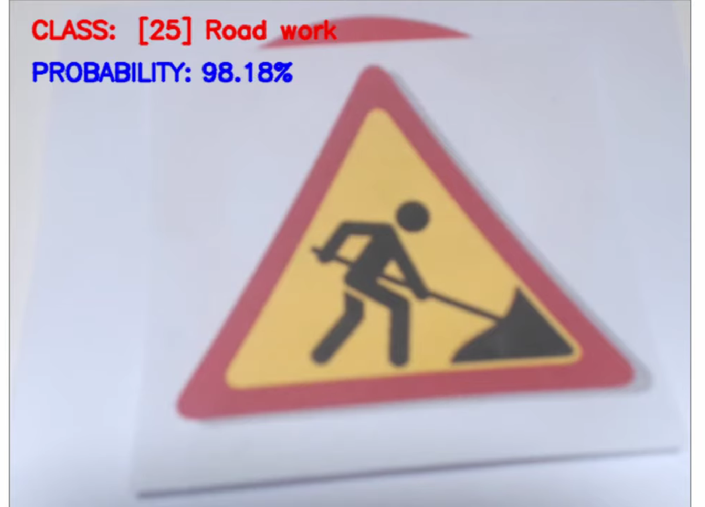
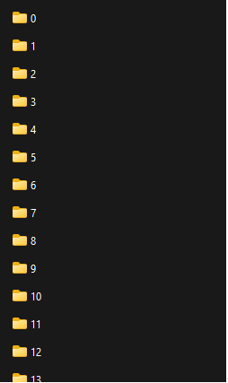

# Classification des panneaux de signalisation à l'aide de réseaux de neurones convolutifs

Nous entraînerons les panneaux de signalisation avec plus de 35 000 images de 43 classes différentes à l'aide de tensorflow et de keras.

[]

# Dataset Source
Lien du dataset : https://sid.erda.dk/public/archives/daaeac0d7ce1152aea9b61d9f1e19370/published-archive.html

1. titre du dataset : German Traffic Sign Recognition Benchmark GTSRB, auteurs : Johannes Stallkamp, Marc Schlipsing, Jan Salmen, Christian Igel
2. j'ai odroné les données de la forme suivante: 
[] 
chaque dossier contient une classe.